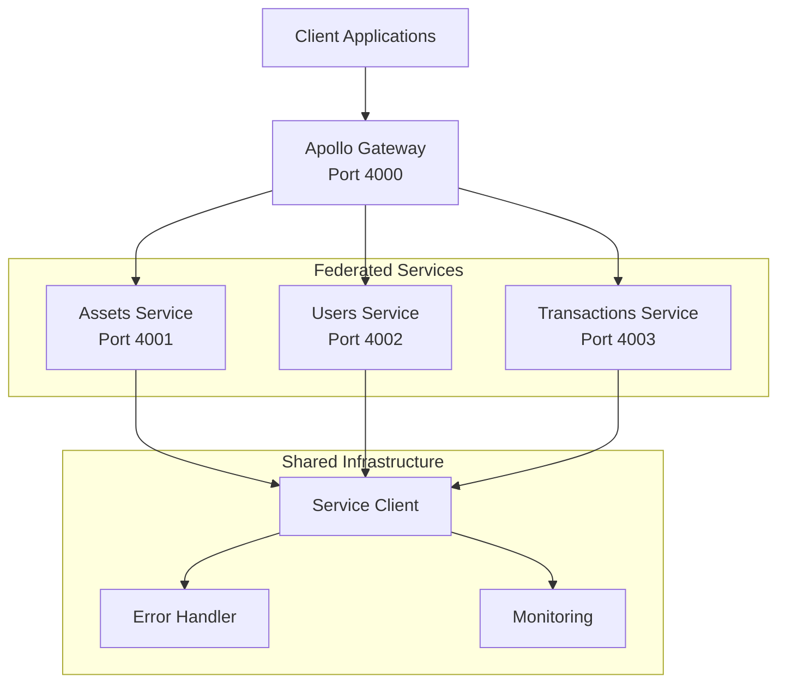
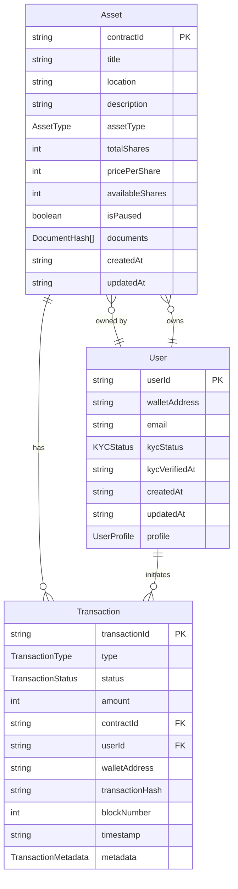

# GraphQL Federation Architecture Implementation

## Overview

This document describes the GraphQL Federation architecture implementation for the Tokenized Fractional RWA Marketplace. The federation enables a scalable microservices architecture with separate schemas for assets, users, and transactions that can be composed into a unified graph.

## Architecture

### Component Diagram



### Service Boundaries

#### Assets Service (Port 4001)
**Responsibilities:**
- Real-world asset metadata management
- Asset ownership tracking
- Asset availability and pricing
- Document management (IPFS hashes)
- Asset lifecycle (create, update, approve, pause)

**Entity:** `Asset @key(fields: "contractId")`

**Key Operations:**
- Query assets with filtering and pagination
- Create/update/delete assets (admin only)
- Approve pending assets
- Pause/unpause trading
- Asset statistics

#### Users Service (Port 4002)
**Responsibilities:**
- User profile management
- KYC status tracking
- Authentication and authorization
- User preferences
- Wallet address management

**Entity:** `User @key(fields: "userId")`

**Key Operations:**
- Query users with filtering
- Update user profiles and preferences
- KYC workflow (initiate, approve, reject)
- User statistics

#### Transactions Service (Port 4003)
**Responsibilities:**
- Transaction record management
- Purchase tracking
- Transfer management
- Transaction status updates
- Transaction analytics

**Entity:** `Transaction @key(fields: "transactionId")`

**Key Operations:**
- Query transactions with filtering
- Create transactions
- Update transaction status
- Cancel/retry transactions
- Transaction statistics

### Entity Relationships



## Federation Schema Design

### Federation Directives Used

- **@key**: Defines primary key for entity composition
- **@provides**: Optimizes field resolution by providing additional fields
- **@shareable**: Marks fields that can be shared across services
- **@external**: Marks fields resolved by other services
- **@override**: Allows overriding fields from other services

### Cross-Service Entity References

#### Asset Entity
```graphql
type Asset @key(fields: "contractId") {
  contractId: ID!
  # ... local fields
  owner: User @provides(fields: "walletAddress")
  transactions: [Transaction!] @provides(fields: "transactionId type status")
}
```

#### User Entity
```graphql
type User @key(fields: "userId") {
  userId: ID!
  # ... local fields
  ownedAssets: [Asset!] @provides(fields: "contractId title")
  transactions: [Transaction!] @provides(fields: "transactionId type amount")
}
```

#### Transaction Entity
```graphql
type Transaction @key(fields: "transactionId") {
  transactionId: ID!
  # ... local fields
  asset: Asset @provides(fields: "title location")
  user: User @provides(fields: "walletAddress kycStatus")
}
```

## Service Communication Patterns

### Service Client

The `ServiceClient` class handles communication between federated services:

**Features:**
- GraphQL query execution with caching
- REST API support (GET/POST)
- Automatic retry logic
- Circuit breaker pattern
- Timeout handling
- Request/response correlation

**Usage Example:**
```javascript
import { serviceRegistry } from './services/shared/serviceClient.js';

const assetsClient = serviceRegistry.get('assets');
const result = await assetsClient.query(`
  query GetAssets($limit: Int) {
    assets(limit: $limit) {
      contractId
      title
      location
    }
  }
`, { limit: 10 });
```

### Error Handling

The `FederatedErrorHandler` provides comprehensive error management:

**Features:**
- Error classification and formatting
- Partial data scenario handling
- Retry logic with exponential backoff
- Circuit breaker pattern
- Error aggregation across services
- Detailed error logging

**Error Codes:**
- `SERVICE_UNAVAILABLE`: Service is down or unreachable
- `TIMEOUT`: Request exceeded timeout threshold
- `VALIDATION_ERROR`: Input validation failed
- `AUTHORIZATION_ERROR`: Authentication/authorization failed
- `NOT_FOUND`: Resource not found
- `INTERNAL_ERROR`: Unexpected internal error
- `FEDERATION_ERROR`: Federation composition error
- `PARTIAL_DATA`: Only partial data returned

### Monitoring

The `FederatedMonitor` tracks performance metrics:

**Metrics Tracked:**
- Query execution time (min, max, average)
- Query frequency and patterns
- Service-level performance
- Error rates by query and service
- Slow query detection
- High error rate detection

**Thresholds:**
- Slow query: > 1000ms
- Warning query: > 500ms
- High error rate: > 10%

## Deployment

### Environment Variables

```bash
# Gateway
GATEWAY_PORT=4000
ADMIN_API_KEY=your-admin-api-key

# Assets Service
ASSETS_SERVICE_PORT=4001
ASSETS_SERVICE_URL=http://localhost:4001

# Users Service
USERS_SERVICE_PORT=4002
USERS_SERVICE_URL=http://localhost:4002

# Transactions Service
TRANSACTIONS_SERVICE_PORT=4003
TRANSACTIONS_SERVICE_URL=http://localhost:4003
```

### Starting Services

#### 1. Start Individual Services
```bash
# Assets Service
cd backend/services/assets
node server.js

# Users Service
cd backend/services/users
node server.js

# Transactions Service
cd backend/services/transactions
node server.js
```

#### 2. Start Gateway
```bash
cd backend/gateway
node index.js
```

### Docker Deployment

Create a `docker-compose.yml` for the federation:

```yaml
version: '3.8'

services:
  assets-service:
    build: ./backend/services/assets
    ports:
      - "4001:4001"
    environment:
      - ASSETS_SERVICE_PORT=4001
      - ADMIN_API_KEY=${ADMIN_API_KEY}

  users-service:
    build: ./backend/services/users
    ports:
      - "4002:4002"
    environment:
      - USERS_SERVICE_PORT=4002
      - ADMIN_API_KEY=${ADMIN_API_KEY}

  transactions-service:
    build: ./backend/services/transactions
    ports:
      - "4003:4003"
    environment:
      - TRANSACTIONS_SERVICE_PORT=4003
      - ADMIN_API_KEY=${ADMIN_API_KEY}

  gateway:
    build: ./backend/gateway
    ports:
      - "4000:4000"
    environment:
      - GATEWAY_PORT=4000
      - ASSETS_SERVICE_URL=http://assets-service:4001
      - USERS_SERVICE_URL=http://users-service:4002
      - TRANSACTIONS_SERVICE_URL=http://transactions-service:4003
      - ADMIN_API_KEY=${ADMIN_API_KEY}
    depends_on:
      - assets-service
      - users-service
      - transactions-service
```

## Query Examples

### Cross-Service Query
```graphql
query GetAssetWithOwnerAndTransactions {
  asset(contractId: "C123...") {
    contractId
    title
    location
    owner {
      userId
      walletAddress
      kycStatus
    }
    transactions(limit: 5) {
      transactionId
      type
      status
      amount
      user {
        walletAddress
      }
    }
  }
}
```

### User with Owned Assets
```graphql
query GetUserWithAssets {
  user(userId: "U123...") {
    userId
    walletAddress
    kycStatus
    ownedAssets {
      contractId
      title
      availableShares
      pricePerShare
    }
  }
}
```

### Transaction with Full Context
```graphql
query GetTransactionWithContext {
  transaction(transactionId: "T123...") {
    transactionId
    type
    status
    amount
    asset {
      title
      location
      assetType
    }
    user {
      walletAddress
      kycStatus
    }
  }
}
```

## Schema Governance

### Schema Versioning

- Each service maintains its own schema version
- Breaking changes require coordination across services
- Use `@deprecated` directive for field deprecation
- Maintain backward compatibility during transitions

### Schema Composition Rules

1. **Key Fields**: Entities must have consistent key fields across services
2. **Type Consistency**: Shared types must have identical field definitions
3. **Directive Usage**: Federation directives must be used correctly
4. **Naming Conventions**: Follow consistent naming across services

### Schema Validation

Before deploying schema changes:

1. Validate individual service schemas
2. Test schema composition via gateway
3. Verify query plan generation
4. Check for breaking changes
5. Update documentation

## Performance Optimization

### Query Planning Optimization

- Use `@provides` to reduce service calls
- Implement field-level caching
- Optimize resolver chains
- Use DataLoader patterns for batch operations

### Entity Caching Strategies

- **Service-level caching**: Cache frequently accessed entities
- **Gateway caching**: Cache composed query results
- **CDN caching**: Cache public query results
- **Invalidation**: Implement cache invalidation on mutations

### Monitoring and Alerting

- Monitor query execution times
- Track service health and availability
- Alert on high error rates
- Monitor gateway composition performance
- Track slow queries and optimize

## Backward Compatibility

### Transition Strategy

1. **Phase 1**: Deploy federated services alongside existing REST API
2. **Phase 2**: Route read-only queries through federation
3. **Phase 3**: Route mutations through federation
4. **Phase 4**: Deprecate REST endpoints

### Compatibility Features

- REST API remains functional during transition
- Both APIs access same data layer
- No breaking changes to existing clients
- Gradual migration path

## Security Considerations

### Authentication

- API key authentication for admin operations
- JWT token support for user authentication
- Service-to-service authentication
- Request signing for sensitive operations

### Authorization

- Role-based access control (RBAC)
- Field-level authorization
- Service-level authorization
- Query complexity limits

### Rate Limiting

- Per-service rate limiting
- Gateway-level rate limiting
- User-based rate limiting
- Query complexity-based limiting

## Troubleshooting

### Common Issues

#### Gateway Composition Errors
- **Symptom**: Schema composition fails
- **Solution**: Check schema compatibility, verify @key directives, ensure service availability

#### Partial Data Responses
- **Symptom**: Some services return errors
- **Solution**: Check service health, verify network connectivity, review error logs

#### Slow Query Performance
- **Symptom**: Queries take > 1 second
- **Solution**: Review query plan, add @provides directives, implement caching

#### Service Unavailable
- **Symptom**: Service not responding
- **Solution**: Check service logs, verify environment variables, restart service

### Debugging Tools

- Apollo Studio for query analysis
- Gateway query plan inspection
- Service-level logs
- Monitoring dashboard
- Health check endpoints

## Future Enhancements

1. **Subscription Support**: Real-time GraphQL subscriptions
2. **Query Complexity Analysis**: Prevent expensive queries
3. **Advanced Caching**: Redis-based distributed caching
4. **Service Mesh**: Istio or Linkerd integration
5. **Multi-region Deployment**: Geographic distribution
6. **Schema Registry**: Centralized schema management
7. **Automated Testing**: Federation-specific test suite
8. **Performance Profiling**: Advanced performance analysis

## References

- [Apollo Federation Documentation](https://www.apollographql.com/docs/federation/)
- [GraphQL Best Practices](https://graphql.org/learn/best-practices/)
- [Microservices Patterns](https://microservices.io/patterns/)
- [Schema Stitching vs Federation](https://www.apollographql.com/docs/federation/why-federation/)

## Appendix

### File Structure

```
backend/
├── gateway/
│   └── index.js                    # Apollo Gateway
├── services/
│   ├── assets/
│   │   ├── schema.graphql          # Assets federated schema
│   │   ├── resolvers.js            # Assets resolvers
│   │   └── server.js              # Assets service server
│   ├── users/
│   │   ├── schema.graphql          # Users federated schema
│   │   ├── resolvers.js            # Users resolvers
│   │   └── server.js              # Users service server
│   ├── transactions/
│   │   ├── schema.graphql          # Transactions federated schema
│   │   ├── resolvers.js            # Transactions resolvers
│   │   └── server.js              # Transactions service server
│   └── shared/
│       ├── serviceClient.js       # Service communication client
│       ├── errorHandler.js        # Federated error handler
│       └── monitoring.js          # Performance monitoring
```

### API Endpoints

- **Gateway**: `http://localhost:4000/graphql`
- **Assets Service**: `http://localhost:4001/graphql`
- **Users Service**: `http://localhost:4002/graphql`
- **Transactions Service**: `http://localhost:4003/graphql`

### Health Checks

Each service provides a health check endpoint:

- Gateway: `GET /health`
- Assets: `GET /health`
- Users: `GET /health`
- Transactions: `GET /health`

---

**Status**: ✅ Implementation Complete

**Last Updated**: 2026-07-25

**Version**: 1.0.0
